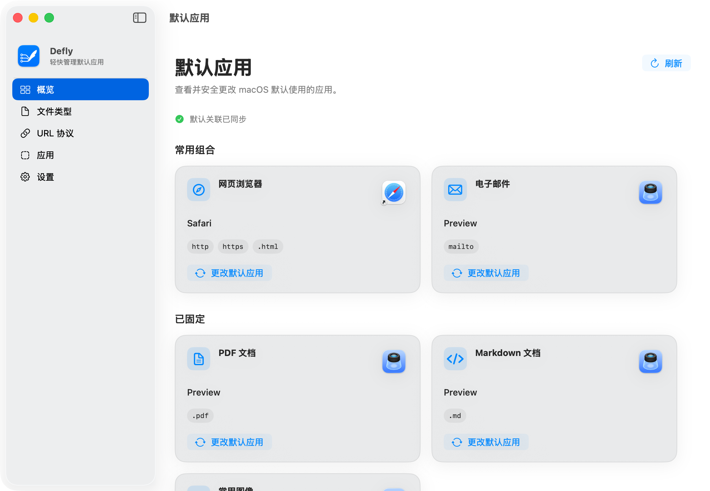
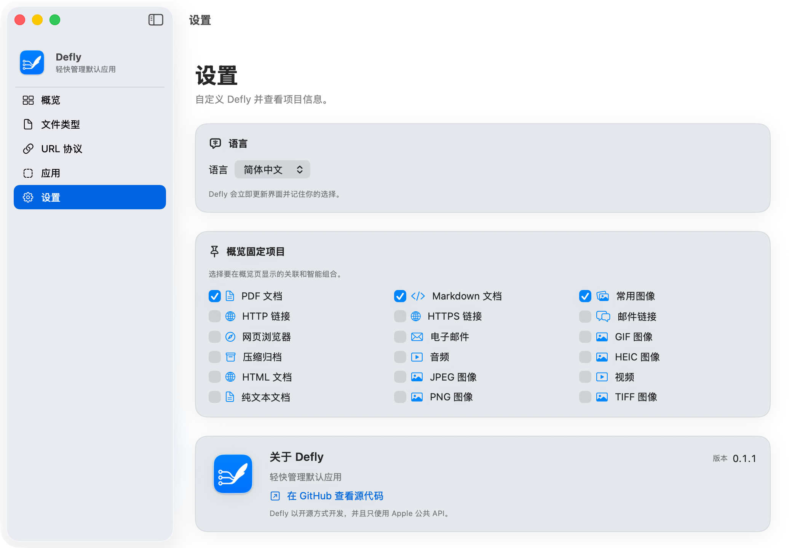

<p align="center">
  
</p>

<h1 align="center">Defly</h1>

<p align="center"><em>Set your defaults simply.</em></p>

Defly 是一款原生 macOS 默认应用管理工具，用来查看并安全修改文件类型、UTType 与 URL Scheme 的默认处理应用。

> **Defly** 取自 **Default + fly**：一键搞定默认设置，轻快利落。

项目参考 [SwiftDefaultApps](https://github.com/Lord-Kamina/SwiftDefaultApps) 的能力范围，但采用独立 App、现代 Apple 公共 API 和明确的二次确认流程，不读写私有 LaunchServices 数据库。

## 界面预览



<p align="center"><sub>概览页通过侧栏品牌区呈现 Defly 图标，并集中展示常用组合和自定义固定项目；截图使用内置测试数据，不读取本机默认应用。</sub></p>



<p align="center"><sub>设置页在“关于 Defly”区域展示应用图标，支持中英文即时切换，并可自由决定概览页显示哪些关联。</sub></p>

## 功能介绍

### 高频默认项一眼可见

概览页将最常用的默认关联组织成清晰卡片，直接显示当前处理应用、覆盖范围和可选候选。内置的“网页浏览器”智能组合会同时管理 `http`、`https` 与 `public.html`，避免网页链接和 HTML 文件分别打开到不同浏览器。

除了浏览器和电子邮件，PDF、Markdown、常用图像等项目都可以按个人习惯固定到概览页；固定内容可随时在设置中调整。

### 从三个维度检查默认关联

- **文件类型**：按 UTType、扩展名、MIME 类型或本地化名称搜索，查看当前默认应用、元数据和系统返回的兼容候选。
- **URL 协议**：检查 `http`、`https`、`mailto` 等 URL Scheme 的默认处理应用。
- **应用**：从已安装 App 反查它声明支持的文件类型与 URL Scheme，理解一次更改会影响哪些关联。

Defly 优先展示 macOS 判定为兼容的应用，同时保留手动选择其他 `.app` 的能力；手动候选会在确认前明确显示兼容性警告。

### 每次修改都经过确认和验证

选择候选应用只会生成变更计划，不会立即写入系统。真正修改前，Defly 会通过原生确认 Sheet 展示原应用、目标应用和每一项原子关联；确认后再串行执行，并保留 macOS 自己的系统同意提示。

执行完成后，Defly 会逐项回读当前默认值，并区分“已验证”“失败”和“未生效”。如果组合中的部分关联修改失败，已经成功的项目会保留，重试时只处理失败或未生效的项目。

### 原生、克制且可定制

- 使用 SwiftUI、系统蓝、macOS 材质和 SF Symbols，保持 Native Utility 风格。
- 默认使用简体中文，可即时切换 English，并持久保存语言选择。
- 自动适配浅色、深色、高对比度与“降低透明度”辅助功能。
- 不常驻菜单栏，不启动后台进程，不联网，也不收集遥测数据。

Defly V1 坚持手动管理，不包含自动恢复、历史回滚、配置档案、导入导出或 CLI。

## 系统要求

- macOS 14 或更高版本
- Xcode 16 或更高版本
- Swift 6
- [XcodeGen](https://github.com/yonaskolb/XcodeGen)
- `jq`（用于验证 String Catalog）

安装开发依赖：

```bash
brew install xcodegen jq
```

## 构建与运行

```bash
git clone https://github.com/maple-yf/Defly.git
cd Defly
xcodegen generate
open Defly.xcodeproj
```

在 Xcode 中选择 `Defly` Scheme 后运行。实际修改默认应用时，macOS 可能显示额外的系统同意提示；拒绝后对应关联保持不变。

也可以在命令行构建无签名调试产物：

```bash
xcodebuild build \
  -project Defly.xcodeproj \
  -scheme Defly \
  -destination 'platform=macOS' \
  CODE_SIGNING_ALLOWED=NO
```

## 验证

```bash
./scripts/verify.sh
```

验证脚本会：

1. 重新生成 Xcode 工程并校验 String Catalog 与补丁格式。
2. 构建并直接运行 `DeflyCoreTests`。
3. 编译 UI 测试 Bundle。
4. 构建 Defly macOS App。

完整 UI 自动化需要当前 Mac 为 XCTest 授予“自动化”权限，可在 Xcode 中运行 `DeflyUITests`。测试覆盖中文首次启动、文件类型搜索、二次确认与部分失败，以及英文切换后的重启持久化。

## 安全边界

- 只使用 `NSWorkspace` 与 `UniformTypeIdentifiers` 公共 API
- 不直接操作 LaunchServices 私有数据库
- 不请求管理员权限，不安装 Helper
- 不联网，不包含遥测
- App Sandbox 关闭以发现标准 Applications 目录，Hardened Runtime 开启
- 手动选择非系统候选应用时会明确显示兼容性警告

## 工程结构

```text
Sources/
├── DeflyApp/       SwiftUI 界面、依赖组装与本地化
└── DeflyCore/      领域模型、应用发现、变更计划与执行
Tests/
├── DeflyCoreTests/
└── DeflyUITests/
```

`DeflyCore` 不依赖 SwiftUI，可供未来 CLI 或其他客户端复用。

详细设计与实施记录：

- [Defly macOS App 设计规格](docs/superpowers/specs/2026-07-26-defly-macos-app-design.md)
- [Defly V1 实施计划](docs/superpowers/plans/2026-07-26-defly-v1-implementation.md)

## English

Defly is a native macOS utility for inspecting and safely changing default handlers for file types, UTTypes, and URL schemes. V1 includes an overview, advanced explorers, explicit atomic change previews, read-back verification, partial-failure retry, and a persistent Chinese/English interface.

## 开源许可

Defly 以开源项目为目标。首次公开发布前仍需由项目所有者选择并加入 OSI 批准的许可证；在许可证文件加入仓库前，默认版权规则适用。
